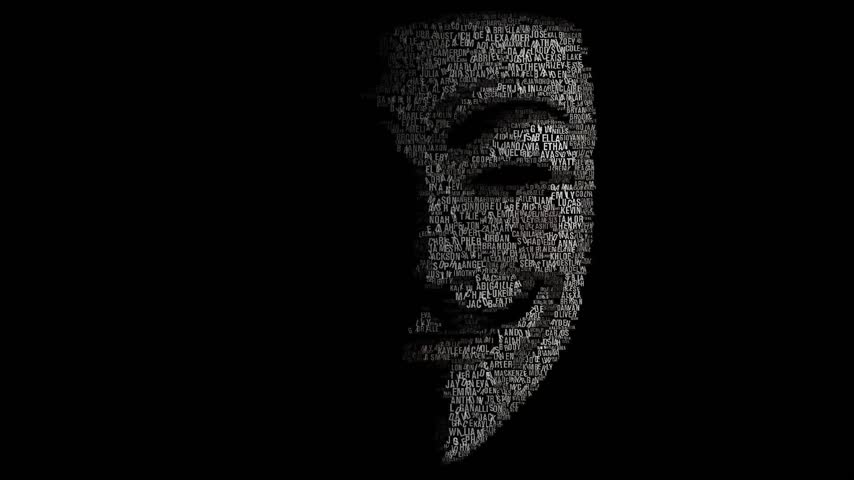

# 🎨 Wallpapers Collection

A curated collection of high-quality wallpapers for your desktop, featuring landscapes, coding themes, anime, and abstract art.

## 📺 Showcase Video

A 60-second slideshow of all wallpapers in this collection is available:
[](https://github.com/DevXtechnic/wallpapers/blob/master/wallpapers_showcase.webm)

*(Note: Click the link above to view or download the video file directly from the repository.)*

## 📂 Content Preview

This repository contains a variety of styles:
- **Nature & Landscapes:** Mountains, forests, and space.
- **Coding & Tech:** Linux, programming, and retro computing.
- **Art & Anime:** Digital art, lofi vibes, and characters.

## 🚀 Usage

You can clone this repository to get all wallpapers:

```bash
git clone https://github.com/DevXtechnic/wallpapers.git
```

Enjoy!
